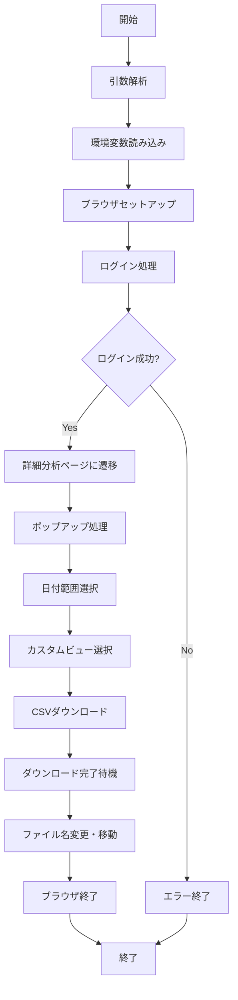
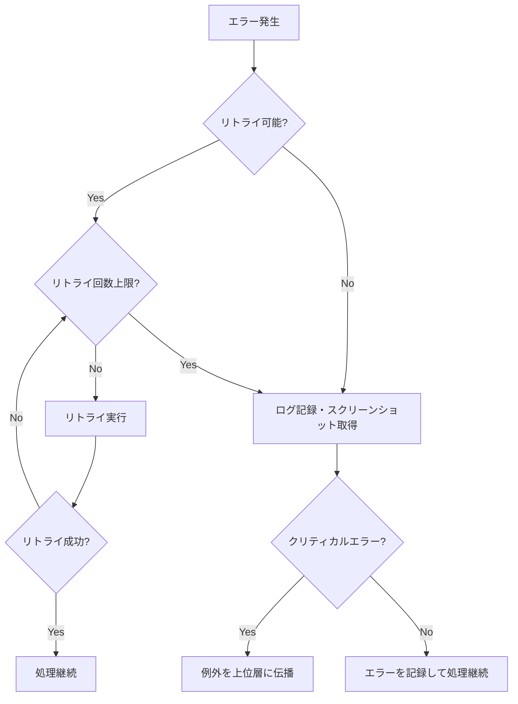
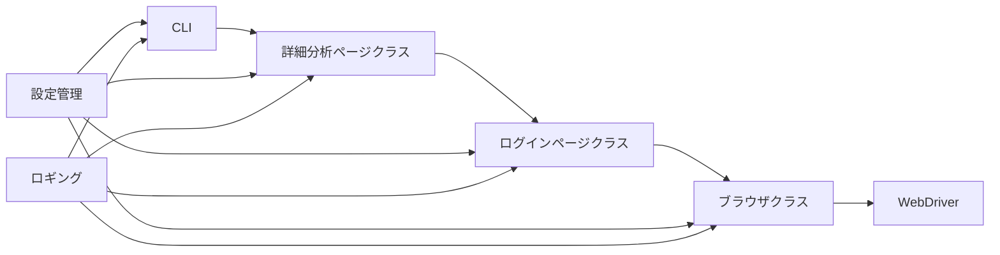

# アドエビス詳細分析ページCSVダウンロード機能 仕様書

## 1. 機能概要

### 1.1 目的
アドエビス（AD EBiS）の詳細分析ページから特定の日付範囲のデータをCSVファイルとして自動的にダウンロードし、指定されたファイル名で保存する機能を提供します。

### 1.2 背景
アドエビスの詳細分析データは、マーケティング効果測定やデータ分析のために定期的にエクスポートする必要があります。この作業を自動化することで、作業効率の向上とヒューマンエラーの排除を実現します。

### 1.3 成果物
- 詳細分析ページCSVダウンロード機能（Pythonモジュール）
- コマンドラインインターフェース
- 必要な設定ファイル
- ユーザードキュメント

## 2. 機能要件

### 2.1 基本機能

| 要件ID | 要件概要 | 優先度 | 備考 |
|--------|---------|--------|------|
| FR-01  | AD EBiSへのログイン処理 | 必須 | 既存のログインページ機能を活用 |
| FR-02  | 詳細分析ページへの遷移 | 必須 | URLは設定ファイルで管理 |
| FR-03  | 日付範囲の指定と適用 | 必須 | 日付ピッカーを操作して対象期間を設定 |
| FR-04  | カスタムビュー選択 | 必須 | プログラム用全項目ビューを選択 |
| FR-05  | CSVファイルのダウンロード | 必須 | インポート→ダウンロードボタンを順にクリック |
| FR-06  | ダウンロードファイルの管理 | 必須 | ファイル名を日付ベースで統一形式に変更 |
| FR-07  | コマンドラインインターフェース | 必須 | 各種オプションをサポート |
| FR-08  | エラーハンドリング | 必須 | 適切なエラーメッセージとリトライ機能 |
| FR-09  | ログ出力 | 必須 | 詳細なログ記録と分析のための情報提供 |
| FR-10  | 複数アカウント対応 | オプション | 異なるアカウントでのダウンロードに対応 |
| FR-11  | ヘッドレスモード | オプション | UIなしでの実行をサポート |

### 2.2 入力パラメータ

| パラメータ名 | 説明 | デフォルト値 | 必須 |
|-------------|------|-------------|------|
| date        | 単一日付（YYYY-MM-DD形式） | 実行日の前日 | いいえ |
| start-date  | 開始日（YYYY-MM-DD形式） | 実行日の前日 | いいえ |
| end-date    | 終了日（YYYY-MM-DD形式） | start-dateと同じ | いいえ |
| account     | アカウント番号 | 1 | いいえ |
| output-dir  | 出力ディレクトリ | settings.iniの設定値 | いいえ |
| headless    | ヘッドレスモード実行 | false | いいえ |
| verify      | 検証モード（ダウンロードなし） | false | いいえ |

### 2.3 出力

| 出力ID | 説明 | フォーマット |
|--------|------|-------------|
| OUT-01 | ダウンロードCSVファイル | YYYYMMDD_ebis_SS_CV.csv |
| OUT-02 | 標準出力ログ | テキスト |
| OUT-03 | ログファイル | テキスト（logs/ebis_download.log） |
| OUT-04 | エラー時スクリーンショット | PNG画像 |

## 3. 処理フロー

### 3.1 メインフロー



### 3.2 エラーハンドリングフロー



## 4. 技術仕様

### 4.1 アーキテクチャ



### 4.2 クラス設計

#### 4.2.1 DetailedAnalysisPage クラス

```python
class DetailedAnalysisPage:
    def __init__(self, browser=None)
    def navigate_to_detailed_analysis()
    def handle_popup()
    def select_date_range(start_date, end_date)
    def select_custom_view()
    def download_csv()
    def wait_for_download_and_process(target_date, output_dir=None)
    def execute_download_flow(start_date, end_date=None, output_dir=None)
    def quit()
```

### 4.3 依存関係

| 依存ライブラリ | バージョン | 用途 |
|---------------|----------|------|
| selenium      | 4.0以上   | WebDriver制御 |
| webdriver-manager | 最新 | ChromeDriverの自動ダウンロード |
| python-dotenv | 最新 | 環境変数読み込み |
| logging       | 標準ライブラリ | ログ管理 |
| argparse      | 標準ライブラリ | コマンドライン引数解析 |
| pathlib       | 標準ライブラリ | パス操作 |
| datetime      | 標準ライブラリ | 日付操作 |

## 5. 設定仕様

### 5.1 settings.ini

```ini
[BROWSER]
headless = false
implicit_wait = 10
page_load_timeout = 30

[AdEBIS]
url_details = https://bishamon.ebis.ne.jp/detail_analyze

[Download]
timeout = 90
directory = data/downloads
```

### 5.2 selectors.csv

```csv
group,name,selector_type,selector_value,description
detailed_analysis,date_picker_trigger,xpath,/html/body/div[1]/div[2]/div[2]/div[1]/div[2]/nav/div[2]/div[1]/div/div[1]/div[2]/input,日付カレンダーを開くボタン
detailed_analysis,start_date_input,xpath,/html/body/div[1]/div[2]/div[2]/div[1]/div[2]/nav/div[2]/div[1]/div/div[2]/div[2]/div[2]/div[1]/div[1]/input[1],開始日入力フィールド
detailed_analysis,end_date_input,xpath,/html/body/div[1]/div[2]/div[2]/div[1]/div[2]/nav/div[2]/div[1]/div/div[2]/div[2]/div[2]/div[1]/div[1]/input[2],終了日入力フィールド
detailed_analysis,apply_button,xpath,/html/body/div[1]/div[2]/div[2]/div[1]/div[2]/nav/div[2]/div[1]/div/div[2]/div[2]/div[2]/div[2]/button[2],適用ボタン
detailed_analysis,view_button,css,#common-bar > div.clearfix.common-bar > nav > div.navbar-nav > a > div.nav-link-custom-view > div:nth-child(2),ビューボタン
detailed_analysis,program_all_view,css,#common-bar > div.clearfix.common-bar > nav > div.navbar-nav > a > div.dropdown-menu.setting-views-dropdown.show > div.setting-views-dropdown__list > div.setting-views-dropdown__list-detail.scrollbar-wrapper > div.scrollbar-wrapper__content > div > div.setting-views-dropdown__item-title.setting-views-dropdown__item-title--apply,プログラム用全項目ビュー
detailed_analysis,import_button,xpath,//*[@id="common-bar"]/div[2]/nav/div[2]/div[4]/div[1],インポートボタン
detailed_analysis,download_button,xpath,//*[@id="common-bar"]/div[2]/nav/div[2]/div[4]/div[2]/a,ダウンロードボタン
```

## 6. エラー処理とロギング

### 6.1 エラーコード

| エラーコード | 説明 | 対応策 |
|------------|------|-------|
| E001 | ブラウザセットアップ失敗 | ChromeDriverとブラウザのバージョン確認 |
| E002 | ログイン失敗 | 認証情報確認、ネットワーク接続確認 |
| E003 | 詳細分析ページ遷移失敗 | URLの確認、アクセス権限確認 |
| E004 | セレクタエラー | セレクタの更新、ページ構造変更確認 |
| E005 | 日付選択失敗 | 日付フォーマット確認、UI変更確認 |
| E006 | カスタムビュー選択失敗 | ビューの存在確認、セレクタの更新 |
| E007 | ダウンロード失敗 | ダウンロード権限確認、ディスク容量確認 |
| E008 | ファイル処理エラー | 出力ディレクトリ権限確認、既存ファイル確認 |

### 6.2 ロギング

- ログレベル: INFO（通常）、DEBUG（詳細モード）
- ログファイル: logs/ebis_download.log
- ログローテーション: 日次
- 最大保存期間: 30日

### 6.3 スクリーンショット

エラー発生時に自動的にスクリーンショットを取得し保存します。
- 保存先: logs/screenshots/
- 命名規則: YYYYMMDD_HHMMSS_エラー種別.png

## 7. テスト計画

### 7.1 単体テスト

| テストID | テスト内容 | 期待結果 |
|---------|----------|----------|
| UT-01 | 日付範囲選択メソッドのテスト | 指定日付が正しく入力される |
| UT-02 | カスタムビュー選択メソッドのテスト | プログラム用全項目ビューが選択される |
| UT-03 | CSVダウンロードメソッドのテスト | ダウンロードボタンがクリックされる |
| UT-04 | ファイル処理メソッドのテスト | ファイルが適切に移動・リネームされる |
| UT-05 | エラーハンドリングのテスト | 適切なエラーメッセージとリトライ動作 |

### 7.2 結合テスト

| テストID | テスト内容 | 期待結果 |
|---------|----------|----------|
| IT-01 | ログインから詳細分析ページ遷移まで | 正常遷移の確認 |
| IT-02 | 日付選択からCSVダウンロードまで | ファイルが正常にダウンロードされる |
| IT-03 | 全体フロー（デフォルト設定） | エンドツーエンドの正常動作確認 |
| IT-04 | 全体フロー（カスタム設定） | 各種オプション指定時の動作確認 |

### 7.3 検証モード

`--verify`オプションでテスト実行できるモードを実装します。このモードではログインと詳細分析ページ遷移までを行い、ダウンロード処理は実行しません。

## 8. 制約条件

### 8.1 技術的制約

- Chrome/Chromiumブラウザが必要
- Python 3.9以上のインストールが必要
- インターネット接続が必要
- アドエビスのUIが変更された場合、セレクタの更新が必要

### 8.2 業務的制約

- アドエビスの使用ライセンスが必要
- ダウンロード処理は業務時間外の実行を推奨（サーバー負荷軽減）
- IPアドレス制限がある場合、許可されたネットワークからの実行が必要

## 9. 拡張性と将来計画

### 9.1 拡張予定機能

- データの自動加工・集計機能
- 複数アカウントの並列処理
- Slack/Teams通知機能
- ダッシュボード連携機能

### 9.2 保守計画

- 月次でのセレクタ検証
- アドエビスの大型アップデート時の動作確認
- ログ分析による問題検出と改善

## 10. 参考資料

- [AD EBiS API ドキュメント](https://developers.ebis.ne.jp/)
- [Selenium WebDriver ドキュメント](https://www.selenium.dev/documentation/webdriver/)
- [Python argparse ドキュメント](https://docs.python.org/3/library/argparse.html)
- [PEP 8 – Python コードスタイルガイド](https://peps.python.org/pep-0008/) 